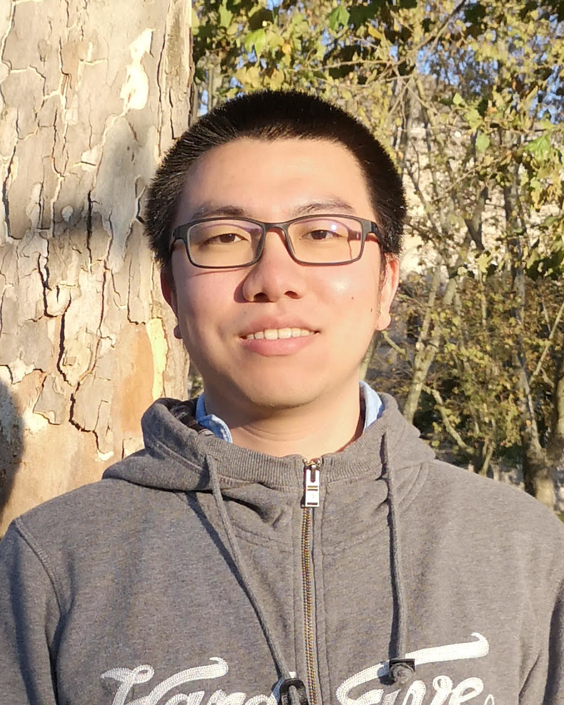
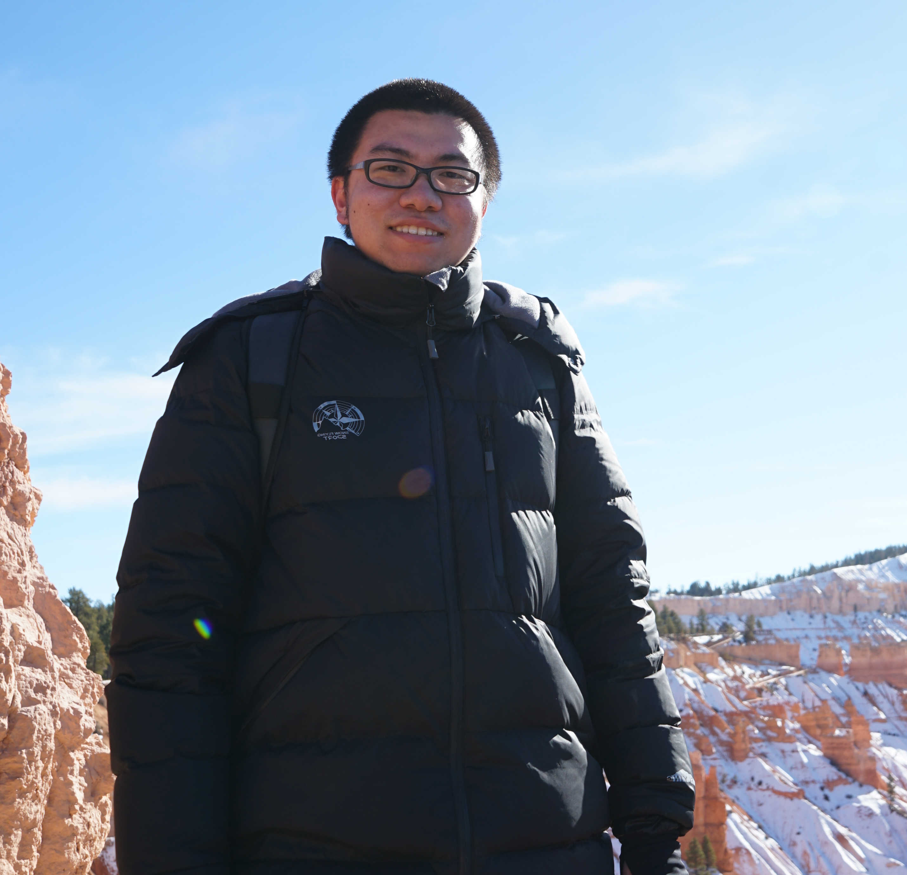
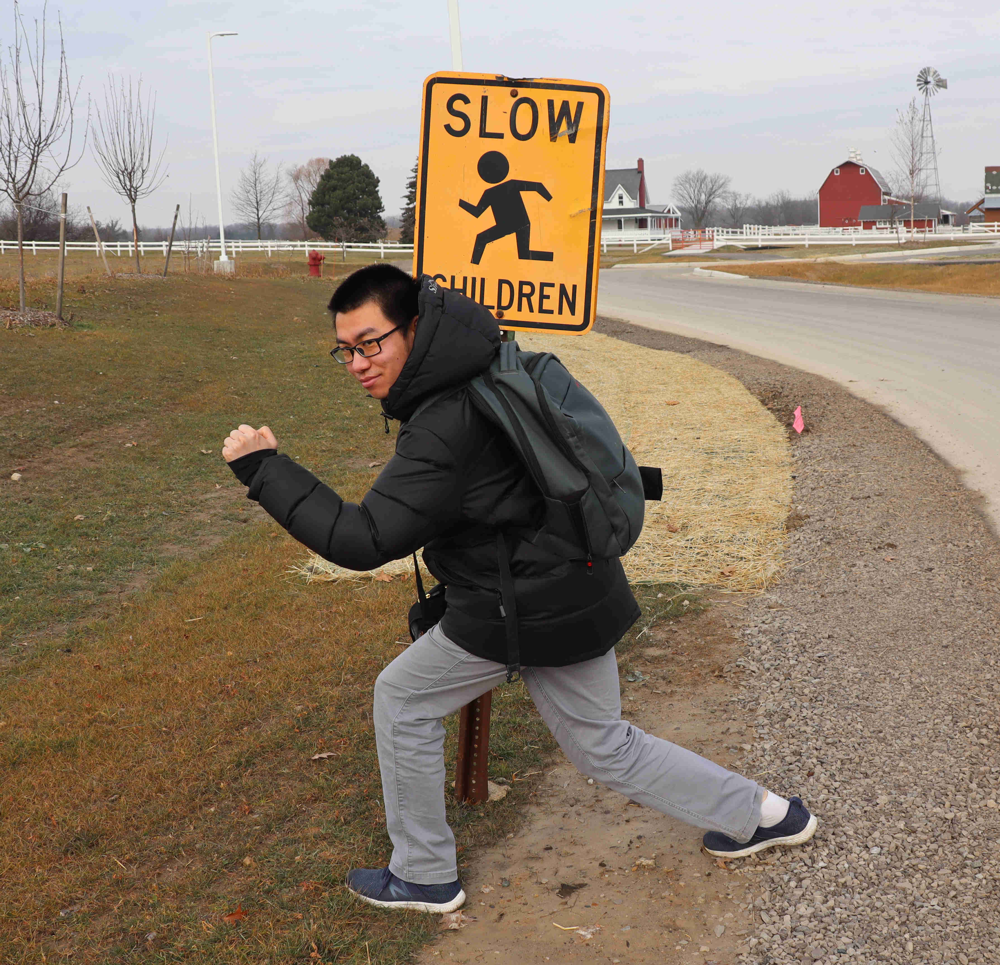

---
# Feel free to add content and custom Front Matter to this file.
# To modify the layout, see https://jekyllrb.com/docs/themes/#overriding-theme-defaults

layout: page
# title: Home
---

<h4><u>About me</u></h4>

I am a fifth-year PhD student from Department of Electrical Engineering and Computer Science at Univerity of Michigan, supervised by <a href="https://web.eecs.umich.edu/~necmiye/index.html">Prof. Necmiye Ozay</a>.

 My current research interests include safety control for systems with preview and delay, system identification and Koopman operator theory. 

Some projects I participated during undergraduate and master programs can be found from [my previous website](https://sites.google.com/site/zexiangliu2016/project).

<!--

-->

 

