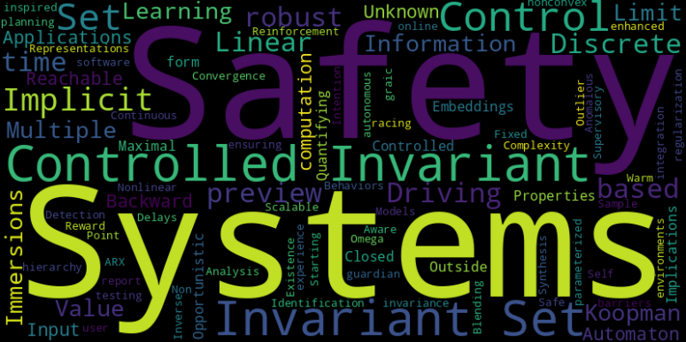

---
# Feel free to add content and custom Front Matter to this file.
# To modify the layout, see https://jekyllrb.com/docs/themes/#overriding-theme-defaults

layout: page
title: Home
---
<h4><u>About me</u></h4>

    
    

        I am currently a postdoctoral fellow at University of Michigan, supervised by <a href="https://web.eecs.umich.edu/~necmiye/index.html">Prof. Necmiye Ozay</a>. 
        I am actively looking for full-time positions related to control, learning, and robotics.
    

    
 
        My current research interests include formal methods, safety control, system identification, data-driven control, and Koopman operator theory.
    

    

        
        
 <em>Word cloud generated from the titles of my publications.</em>

    

